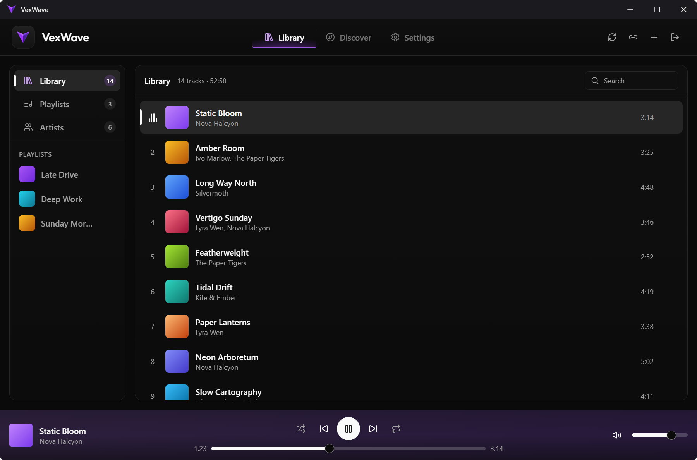
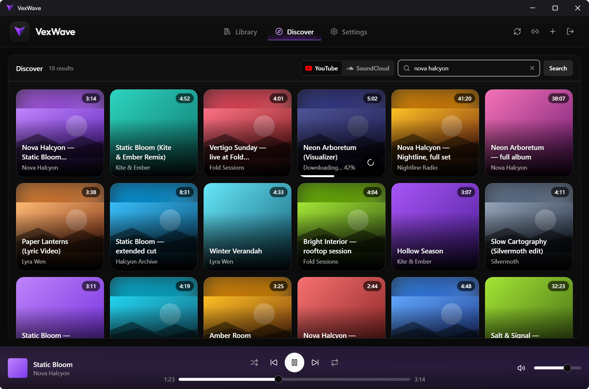
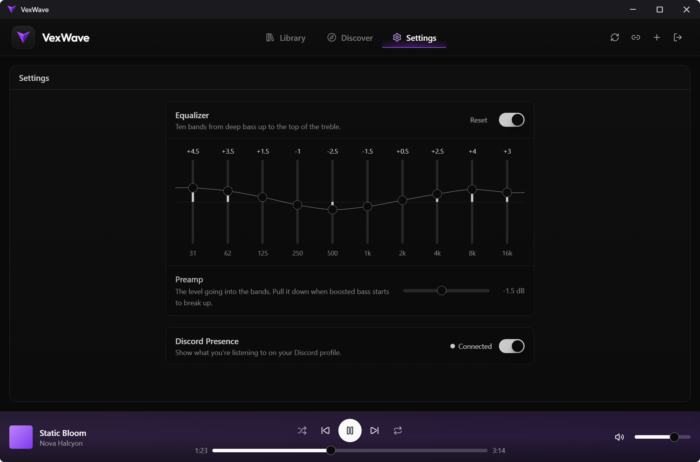

# VexWave

**A desktop music player for the server you already own.**

  

## What it does

### Your server, your library
Sign in with a host, a port and your credentials. No folder to scan, no import step, and search
filters everything you own as you type.

### Playlists and artists
Build playlists, drag their tracks into the order you want, give them cover art, and play any of
them as its own queue. Manage artist names and avatars, and credit as many of them per track as a
song deserves.

### Shuffle worth leaving on
Press play on a playlist, an artist or the whole library and the queue becomes that collection.
Shuffle gives every track its turn before any comes round again and spaces out what you heard most
recently, and Previous walks back through what actually played rather than up the list.

### Drop in local files
Drag audio onto the window. VexWave reads the tags, shows you what it found so you can correct it,
and uploads the files to your server.

### Import from a link
A YouTube or SoundCloud URL becomes a real track in your library, with the creator suggested as an
artist.

### Search both platforms from inside the app
Discover searches YouTube and SoundCloud and downloads a hit straight into your library — the same
review step a pasted link goes through, so nothing lands unchecked.

### Edit anything
Retitle a track, swap its cover, fix its credits or delete it, straight from the row.

### Shape the sound
A ten-band equalizer sits in the playback graph, so a change is heard on the track already playing.
Beside it, a switch for putting what you're listening to on your Discord profile.

